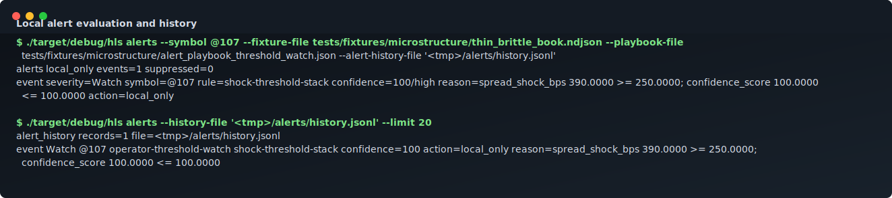

# hlscreen

[](https://github.com/s1korrrr/hlscreen/actions/workflows/ci.yml)
[](LICENSE)
[](rust-toolchain.toml)

`hlscreen` is a read-only Rust workspace for Hyperliquid spot market-data recording, replay, feature calculation, and terminal screening.

It is built for operators and researchers who want a local-first way to inspect public Hyperliquid spot microstructure without touching wallets, private keys, account streams, or order endpoints.

`hlscreen` is an independent open-source project. It is not affiliated with, endorsed by, or sponsored by Hyperliquid. Hyperliquid names and marks belong to their respective owners.

## Status

Current state: pre-1.0 read-only live-data preview with bounded local validation. Recording, replay, screening, deterministic terminal rendering, health checks, and local release-package dry runs are implemented, but unattended production readiness is not yet proven. It is not a trading bot, hosted service, or capital-touching execution system.

Latest live validation: a 2026-07-20 15-minute supervised all-symbol run at
commit `4306d6b` covered `314` spot markets through `943` public subscriptions
and processed `314,923` WebSocket messages / `322,858` normalized events. It
stopped cleanly with `0` reconnects, gaps, parser drops, or failed backfills,
then passed two replay confidence checks with zero drift, missing, or extra
rows. See the
[machine-readable soak report](docs/evidence/soak/sota-allpairs-20260720-15m.json).

Implemented today:

- Public Hyperliquid REST metadata parsing for `spotMeta` and `spotMetaAndAssetCtxs`.
- Public WebSocket parsing for trades, BBO, selected-symbol L2 snapshots, all-mids, active asset context, and candles, with deterministic fixtures kept for tests.
- Bounded public WebSocket live screen with duration-based shutdown, heartbeat pings, inbound inactivity detection, rate-limited reconnect/resubscribe, optional raw/normalized recording, and all-symbol subscription budgeting.
- Bounded live recording through a fail-closed writer queue so disk I/O does not silently drop or stall market-data ingestion.
- Adaptive Ratatui live cockpit for TTY sessions and `--tui` smoke captures, with differential rendering, non-bursting refresh timers, a true display-only pause, watchlist, detail, market internals rail, real 1m OHLC/volume chart, book, tape, status bar, color, persisted display preferences, visible wide/medium/narrow layout profiles, resize-aware layouts, keyboard pane zoom, mouse pane focus, and command-palette editing for filters, presets, and sort order.
- Wide Ratatui headers include a selected-pair quote rail with bid/ask share, spread, top-book depth, flow, and an explicit public-BBO read-only marker.
- Deterministic non-TTY terminal rendering for market rows, scan KPIs, selected-pair microstructure detail, read-only safety state, operations health, and keyboard command rail.
- Confidence-aware feature snapshots and TUI rows for fresh, sparse, duplicate, and explicit gap/parser/backlog quality inputs.
- Persisted confidence baselines plus `hls replay --verify-parity` drift detection for local replay checks.
- Deterministic score breakdowns, screen-rule score fields, and `hls explain` why-ranked output for replayed or fixture-backed rows.
- Compressed raw public message recording, normalized replay JSONL, analytical Parquet export/replay with schema manifests, and local SQLite metadata with unique, path-safe run IDs and registry-path validation.
- Deterministic screening DSL and built-in screen presets.
- Health snapshots, reconnect simulation, TUI health rendering, and read-only local API helpers.
- Plain and bounded-live loopback servers handle SIGINT/SIGTERM on Unix and
  CTRL-C on Windows, stop HTTP/WebSocket work, release the listener, and report
  signal-listener failures instead of claiming a clean stop.
- Deterministic public fixture benchmark packs through `hls bench`.
- Low-cardinality metrics snapshots in `hls doctor --live --json`, including Prometheus text output.
- Manual `hls backfill` and opt-in `hls live --record --backfill-gaps` coarse public candle coverage with durable partial/unrepaired attempt evidence.
- Bounded standalone Wasm row-annotation extensions that reject imports, network/filesystem/private/trading permissions, oversized modules, hash mismatches, and excess memory/output.
- Hardened cargo-dist candidate packaging with pull-request artifact builds,
  SHA-256 checksums, a source archive, CycloneDX SBOM, auditable Rust binaries,
  SHA-pinned actions, and tag-only publication/provenance.

Not implemented yet:

- Supported long-running localhost daemon/service lifecycle.
- Published release binaries from a reviewed `v*` tag run.
- Production alert delivery/operations, validated canonical production
  microstructure metrics, service-backed analog search, and multi-day supervised
  soak proof.
- Private account access, fee-tier lookup, and realized-fill modeling are outside
  the public/read-only trust boundary rather than partially implemented.

## Screenshots

These committed SVGs are deterministic terminal captures generated from the current binary and used for documentation regression. Real public WebSocket smoke evidence is tracked in [Production readiness](docs/production-readiness.md) and dated reports under [docs/reports](docs/reports/).

### Live Market Board


### Data Confidence Pane


### Liquidity Resilience Board


### Why Ranked Detail


### Metadata Discovery


### Record And Replay


### Health JSON


### Health Panel


### Local Alert History



### Symbol Metadata


Regenerate these assets with:

```bash
python3 scripts/generate-screenshots.py
```

## Safety Boundary

`hlscreen` is read-only market-data infrastructure.

It does not provide:

- Wallet connection.
- Private-key handling.
- Order placement.
- Cancel/withdrawal/exchange-action routes.
- Leverage or execution controls.
- Financial advice.
- Profitability claims.

Scores and presets are screening heuristics only. They are not signals, recommendations, or strategy proof.

## Operational Bounds

Local server lifecycle and validation are fail-closed but remain experimental:

- `hls server` and `hls server --live` bind only to loopback. A supported signal
  stops new HTTP accepts, live publication and public WebSocket work, drains
  connection tasks, releases the port, and exits zero. This is not an
  authenticated daemon or unattended service guarantee.
  The local process smoke proves plain-server SIGTERM behavior on Unix. Shared
  signal mapping and live-publisher cancellation are unit-tested; the live
  process path and Windows CTRL-C branch are not runtime-proven by that smoke.
- Public REST backfill is limited to 1,100 weighted units per rolling minute;
  live and server WebSocket clients keep outbound messages to 1,900 per rolling
  minute and new connections to 29 per rolling minute. Those are application
  headroom limits below the documented exchange ceilings, not an availability
  guarantee.
- Local analog replay keeps only five-minute samples and the newest 288
  candidates per symbol. It omits sub-five-minute and older historical states.
- Hosted-surface reads are finite: 120 seconds per `gh` API call and 10 seconds
  for the local Git SHA read by default. Test overrides are limited to 1–600
  seconds through `HLS_GH_READ_TIMEOUT_SECS` and 1–60 seconds through
  `HLS_LOCAL_GIT_TIMEOUT_SECS`; invalid or oversized values fail before
  conversion, and a timeout is a redacted gate failure.

See [Deployment status](docs/deployment.md) for the remaining supervisor,
durability, authentication, observability, soak, and recovery limits.

## Quick Start

Build requirements:

- [`rustup`](https://rustup.rs/) with the repository's Rust 1.88-or-newer
  toolchain.
- A native build toolchain for your platform:
  - macOS: Xcode Command Line Tools (`xcode-select --install`).
  - Debian/Ubuntu Linux: `build-essential`.
  - Windows: MSVC C++ Build Tools with the Desktop development with C++ workload.

Contributor validation additionally requires Git, Python 3, the `rustfmt` and
`clippy` rustup components, and `pkg-config` on Linux. A network connection is
needed for public REST metadata and live public WebSocket commands; fixture,
replay, and local-only commands can run without exchange network access.

Platform contract for the first candidate release:

| Platform | Target | Current evidence |
| --- | --- | --- |
| macOS Apple Silicon | `aarch64-apple-darwin` | Primary development/runtime platform; local release smoke covered |
| macOS Intel | `x86_64-apple-darwin` | Packaging configured; clean-runner candidate artifact proof pending |
| Ubuntu-compatible x86-64 Linux | `x86_64-unknown-linux-gnu` | CI/build packaging configured; candidate artifact install proof pending |
| Windows 10/11 x86-64 | `x86_64-pc-windows-msvc` | Packaging configured; Windows terminal and CTRL-C runtime proof pending |

Rust 1.88 is the minimum supported Rust version. Other targets may build but
are not part of the first release contract.

Build:

```bash
cargo build --workspace --all-features --locked
```

Run the fast local validation gate while iterating:

```bash
scripts/check.sh fast
```

This checks formatting, the locked workspace dependency graph, workspace tests,
and diff hygiene. Use `scripts/check.sh pr` before opening a pull request; it
adds full clippy, release, rustdoc, screenshot, and release-packaging checks.

Initialize a local data directory:

```bash
./target/debug/hls init --data-dir /tmp/hlscreen-smoke
./target/debug/hls doctor --data-dir /tmp/hlscreen-smoke
```

`hls init` writes `config.toml` as a reviewed configuration draft.
Runtime commands currently use explicit CLI flags; `hls doctor` loads the file to
validate its read-only safety settings. Treat the command help as the current
configuration contract until runtime-wide config precedence is implemented.

Fetch read-only public spot metadata:

```bash
./target/debug/hls symbols --top 5
```

Run the current workspace's interactive public live screen:

```bash
cargo run -p hls-cli -- tui
```

`hls tui` is the default interactive workstation entrypoint. It enables the
Ratatui cockpit, tracks the top 10 public spot pairs, refreshes once per second,
uses the ANSI color theme by default, and runs until `q`, `Esc`, `Ctrl-C`, or
`SIGTERM`. Its default `--duration-secs 0` means run until an operator stops it;
pass a positive duration for automation. It remains read-only: no wallet,
private stream, signing, order route, or execution capability is loaded.

For a shell-wide `hls` command, install the exact checked-out workspace once:

```bash
cargo install --path crates/hls-cli --locked --force
hls tui
```

Use `hls live --tui` when you want a scripted recording run with explicit
storage flags:

```bash
tmpdir="$(mktemp -d /tmp/hlscreen-live.XXXXXX)"
./target/debug/hls live \
  --all-symbols \
  --duration-secs 900 \
  --refresh-secs 60 \
  --tui \
  --record \
  --raw \
  --normalized \
  --run-id allpairs-15m \
  --data-dir "$tmpdir"
./target/debug/hls replay --data-dir "$tmpdir" --run-id allpairs-15m
./target/debug/hls replay --data-dir "$tmpdir" --run-id allpairs-15m --verify-parity
```

Run a short public live smoke for one symbol:

```bash
./target/debug/hls tui \
  --symbols HYPE/USDC \
  --duration-secs 30 \
  --refresh-secs 5
```

Optionally evaluate a local-only alert playbook in the TUI:

```bash
./target/debug/hls tui \
  --symbols HYPE/USDC \
  --alert-playbook-file tests/fixtures/microstructure/alert_playbook_tui_watch.json
```

Alert evaluation runs on draw ticks outside WebSocket ingestion. Press `6` to
focus the Status pane, then use `j`/`k` to navigate the bounded newest-first
history. The playbook validator rejects every action except `local_only`.

Run the same smoke while recording raw and normalized local evidence:

```bash
./target/debug/hls live \
  --symbols HYPE/USDC \
  --duration-secs 30 \
  --refresh-secs 5 \
  --tui \
  --record \
  --raw \
  --normalized \
  --run-id one-symbol-live \
  --data-dir "$(mktemp -d /tmp/hlscreen-live.XXXXXX)"
```

TTY keyboard controls for the Ratatui `hls tui` / `hls live --tui` cockpit:

- `↑`/`↓` or `k`/`j`: move the focused market row, or navigate alert history
  while the Status pane is focused.
- `←`/`→` or `[`/`]`: cycle pane focus across watchlist, detail, chart, book, tape, and ops/status.
- `PgUp`/`PgDn`, `Home`, `End`: jump through the visible board.
- `w`/`1`, `i`/`2`, `c`/`3`, `b`/`4`, `r`/`5`, `o`/`6`: focus watchlist, instrument detail, chart, book, tape/recent trades, and ops/status panes.
- `Enter`: focus the selected symbol detail pane when no command editor is open.
- `h` / `H`: focus the health/status operations pane.
- `Tab` / `Shift+Tab`: cycle detail views: overview, flow, quality, metadata, explain.
- `g`: open the symbol jump editor with a live candidate radar; `Enter` selects the first visible row matching a display pair or feed ID, `Esc` cancels.
- `/`: open the validated filter editor; `Enter` applies, `Esc` cancels, empty input clears the custom filter.
- `p`: open the preset editor; `Enter` applies, `Esc` cancels, empty input clears the preset.
- `s`: open the sort editor; `Enter` applies, `Esc` cancels, empty input clears the custom sort.
- `t`: cycle chart window: 1m, 5m, 15m, 30m, 60m.
- `z`: expand/collapse the focused pane while keeping the header, controls, and read-only status visible.
- `d`: cycle row density.
- `?` or `F1`: show/hide help.
- `Space`: freeze/unfreeze displayed rows, candles, and public prints while ingestion, recording, navigation, and health counters continue.
- `q` or `Esc`: cleanly stop the live run.

TTY mouse controls for terminals with mouse reporting enabled:

- Wheel over a pane: scrolls that pane's native control, so watchlist moves rows, detail cycles views, and chart cycles windows.
- Click a watchlist row: selects that pair.
- Click an inactive pane rail/tab: focuses that pane.
- Click the already-active pane rail/tab: expands or collapses that pane, matching `z`.
- Click detail view tabs, chart window tabs, or header command controls: activates the visible read-only display control.
- Click the market internals rail: rows/heat/up/down focuses watchlist, tradeability/staleness focuses status, flow focuses tape, and depth focuses book.
- On wide terminals, click the selected-pair quote rail: symbol/quote focuses detail, bid/ask/top-book focuses book, and flow focuses tape.
- Wide charts fuse public candles and time-and-sales with print markers and an orderflow ribbon; these are read-only public trade/candle lenses, not fills or advice.
- On ultra-wide terminals, click the top `CMD DOCK` for pane focus, symbol jump, filter, preset, sort, chart window, density, zoom, pause, help, and quit.
- On medium and standard-wide terminals, click the header `CMD g / p s t d z sp ? q` rail for symbol jump, filter, preset, sort, timeframe, density, zoom, pause, help, and quit.
- Click the bottom `ACTION STRIP` in wide/medium terminals: activates visible controls such as symbol jump, density, pause, filter, preset, sort, chart window, help, and quit.
- Standard-wide watchlists keep a selected-row context rail under the scanner table when there is enough height, so row actions, leaders, and read-only scan context remain visible even when the left column is narrower.
- On narrow terminals, the compact `/pstdzsp h? q` rail is clickable: filter, preset, sort, timeframe, density, zoom, pause, health/status, help, and quit.
- On very short terminals under 20 rows, the TUI switches to a clickable `MICRO LAYOUT` command/pane rail that keeps the focused pane, resize-safe controls, color diagnostics, and read-only status visible.

Color defaults to `always` for `hls tui` and `hls live --tui`, so the Ratatui workstation uses
the ANSI theme out of the box. Use `--color auto` to follow terminal and
environment detection, or `--color never` for deterministic monochrome output.
Medium and wide layouts show the active visual path in the top header and bottom
action strip, such as `VISUAL ansi-neon active` or `VISUAL plain fallback`, so
screenshots make color mode drift obvious without crowding narrow terminals.
The legacy `HLS_FORCE_COLOR=1`, `CLICOLOR_FORCE=1`, and `FORCE_COLOR=1`
environment overrides still force color in `auto`; `NO_COLOR=1` or `TERM=dumb`
still disables color in `auto`. Explicit `--color always` overrides `NO_COLOR`.

The interactive renderer owns stderr while the alternate screen is active;
stdin and stderr must both remain attached to a TTY for the default unbounded
session. Redirecting stderr disables interactive terminal ownership. Stdout is
reserved for the completion summary after terminal restoration.

To verify which binary and terminal policy the shell is actually using:

```bash
command -v hls
hls --version
hls doctor --terminal
```

The version must include `ratatui-workstation`, and `doctor --terminal` reports
the executable path, working directory, TTY state, renderer, `TERM`,
`COLORTERM`, `TMUX`, `NO_COLOR`, and force/auto color decisions without creating
the data directory. If the renderer tag is missing, the shell found an older
binary. Reinstall from this checkout, then run `hash -r` in Bash/Zsh (or
`rehash` in shells that provide it). When multiple worktrees exist, confirm the
source being built with `git rev-parse --show-toplevel` and
`git rev-parse --short HEAD`; `cargo run -p hls-cli -- tui` always uses the
current workspace and avoids an unrelated global install.

Live TTY sessions persist display-only TUI preferences at
`<data-dir>/tui-preferences.toml`, including the active view, row density, and
chart window. Delete that file to return to the default overview/balanced/15m
layout. This file does not contain wallet, private stream, or order-route data.

`hlscreen` keeps Hyperliquid's transport IDs separate from user-facing symbols.
For example, live `spotMeta` currently maps display `HYPE/USDC` to feed ID
`@107`, and `UETH/USDC` to `@151`. The `live` command accepts display pairs
case-insensitively with either slash or hyphen separators, e.g. `HYPE/USDC` or
`hype-usdc`, and subscribes to the correct feed ID internally. Use `hls symbols`
to inspect the current mapping.

Run deterministic fixture commands for tests or offline docs:

```bash
./target/debug/hls live \
  --symbols @107 \
  --fixture-file tests/fixtures/hyperliquid/ws_mock_live.ndjson \
  --preset thin_books \
  --once
```

Record and replay deterministic fixture data:

```bash
tmpdir="$(mktemp -d /tmp/hlscreen-smoke.XXXXXX)"
./target/debug/hls record \
  --symbols @107 \
  --fixture-file tests/fixtures/hyperliquid/ws_mock_live.ndjson \
  --raw \
  --normalized \
  --run-id smoke \
  --data-dir "$tmpdir"
./target/debug/hls replay --data-dir "$tmpdir" --run-id smoke
./target/debug/hls replay --data-dir "$tmpdir" --run-id smoke --verify-parity
```

Screen deterministic fixture rows:

```bash
./target/debug/hls screen \
  --fixture-file tests/fixtures/hyperliquid/ws_mock_live.ndjson \
  --where 'spread_bps < 75 and tob_depth_usd > 100' \
  --sort ret_5m:desc
```

Explain why a replayed or fixture-backed symbol ranked:

```bash
./target/debug/hls explain \
  --fixture-file tests/fixtures/microstructure/resilience_shock.ndjson \
  --symbol @107
```

Print health JSON:

```bash
./target/debug/hls doctor --live --json
./target/debug/hls server --print-health
```

Run the deterministic public benchmark pack:

```bash
./target/debug/hls bench \
  --manifest tests/fixtures/microstructure/benchmark_gap_replay.json \
  --repo-root . \
  --json
```

Additional local read-only commands include `hls export-parquet`, `hls alerts`,
`hls analog`, and `hls extension`. Run each command with `--help` for its explicit
fixture/replay inputs and output options.

## Architecture

Workspace crates:

- `hls-core`: shared config, symbols, errors, state, health, and telemetry contracts.
- `hls-hyperliquid`: public Hyperliquid REST/WebSocket parsing and connection helpers.
- `hls-store`: compressed raw capture, normalized replay data, analytical Parquet, metadata registry, replay readers, and benchmark packs.
- `hls-features`: rolling feature windows and formulas.
- `hls-screen`: screening DSL, presets, and row filtering/sorting.
- `hls-tui`: terminal rendering.
- `hls-server`: read-only local API response helpers.
- `hls-cli`: command routing and operator workflows.

See [docs/architecture.md](docs/architecture.md).

## Data Files

Local recording writes under the configured data directory:

- `raw/ws/run=<run-id>/part-*.ndjson.zst`
- `normalized/events/run=<run-id>/part-*.ndjson`
- `hls.sqlite`

Other opt-in commands can write `config.toml`, `tui-preferences.toml`, alert
history JSONL, analog-index JSON, confidence baselines, and Parquet datasets
with schema manifests. See the privacy document for the complete inventory.

These files are local artifacts and should not be committed.

Run IDs are unique recording identities, not paths. They may contain ASCII
letters, numbers, `.`, `-`, and `_`, are limited to 128 bytes, and cannot be
reused in the same data directory. Replay rejects registry file paths that are
absolute or contain parent-directory traversal.

See [docs/data-format.md](docs/data-format.md) and [docs/PRIVACY.md](docs/PRIVACY.md).

## Screening Rules

The screening DSL supports:

- Boolean operators: `and`, `or`
- Comparisons: `>`, `>=`, `<`, `<=`, `==`, `!=`
- Literals: numbers, strings, booleans
- Function: `abs(field)` for numeric fields
- Sort syntax: `field:asc`, `field:desc`, `abs(field):asc`, `abs(field):desc`
- Safety bounds: at most 256 nested parenthesis levels and 256 total boolean
  operators per filter; oversized filters fail without replacing the active rule.

Examples are in [examples/screen-rules.md](examples/screen-rules.md).

## Documentation

- [Architecture](docs/architecture.md)
- [Production readiness](docs/production-readiness.md)
- [Data format](docs/data-format.md)
- [Feature definitions](docs/feature-definitions.md)
- [Threat model](docs/THREAT_MODEL.md)
- [Privacy](docs/PRIVACY.md)
- [Roadmap](docs/ROADMAP.md)
- [Release checklist](docs/RELEASING.md)
- [Extension contract](docs/extensions.md)
- [Open source checklist](docs/OPEN_SOURCE_CHECKLIST.md)
- [Production-readiness live refresh](docs/reports/2026-07-08-production-readiness-live-refresh.md)
- [Live production hardening report](docs/reports/2026-07-08-live-production-hardening.md)
- [Live smoke report](docs/reports/2026-07-08-live-smoke.md)
- [Pre-merge audit](docs/reports/2026-07-08-pre-merge-audit.md)
- [2026-07-10 end-to-end release audit](docs/reports/2026-07-10-end-to-end-release-audit.md)

## Contributing

Read [CONTRIBUTING.md](CONTRIBUTING.md) before opening a PR.

The short version:

```bash
scripts/check.sh pr
```

Security issues should follow [SECURITY.md](SECURITY.md). General support guidance is in [SUPPORT.md](SUPPORT.md).

## License

MIT. See [LICENSE](LICENSE).
