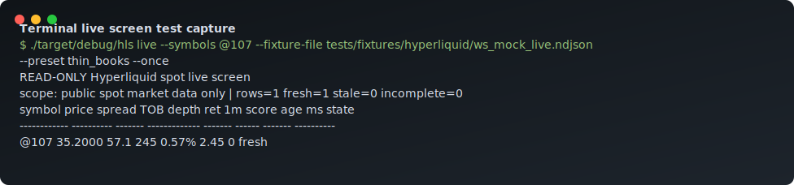
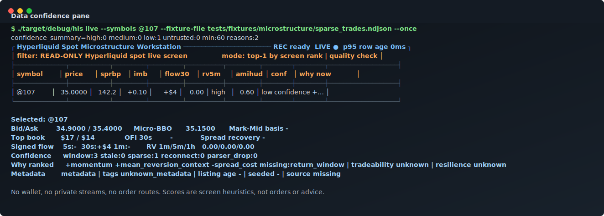
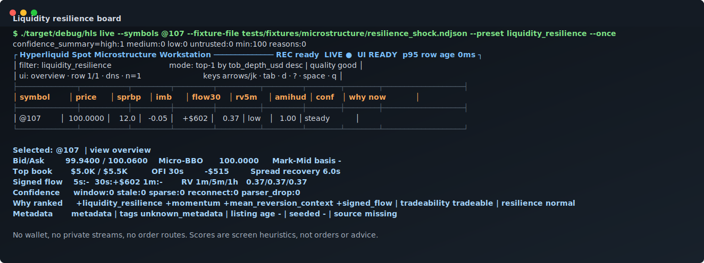
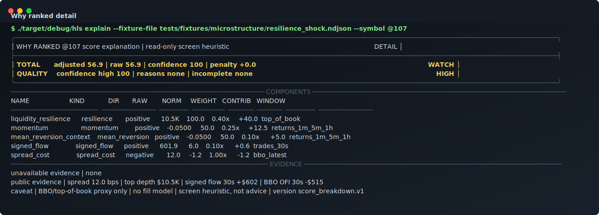
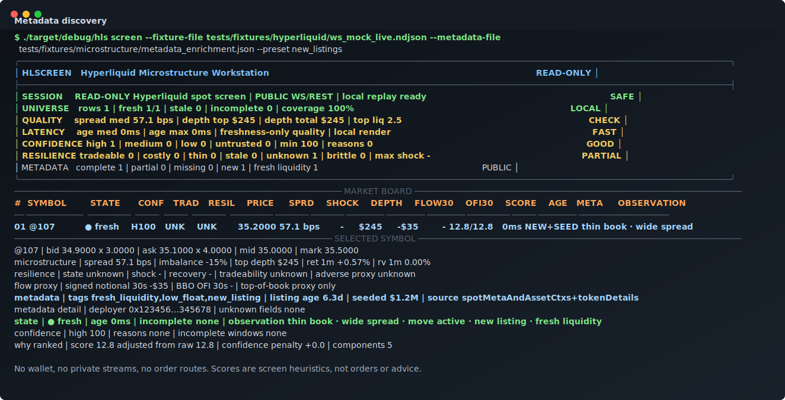
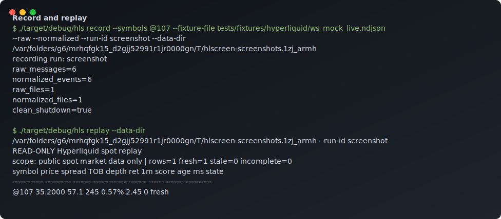
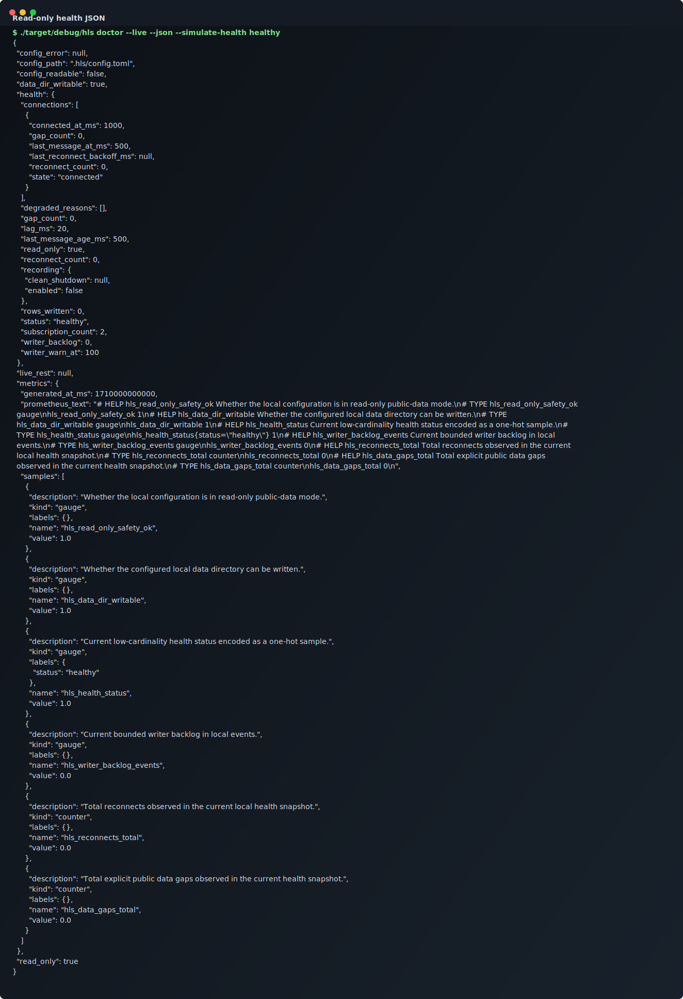
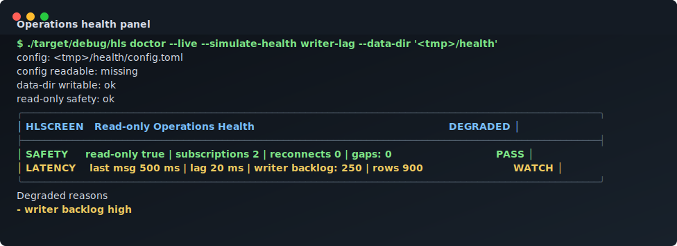
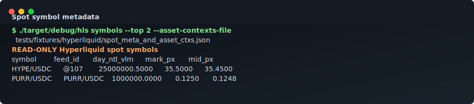

# hlscreen

[](https://github.com/s1korrrr/hlscreen/actions/workflows/ci.yml)
[](LICENSE)
[](rust-toolchain.toml)

`hlscreen` is a read-only Rust workspace for Hyperliquid spot market-data recording, replay, feature calculation, and terminal screening.

It is built for operators and researchers who want a local-first way to inspect public Hyperliquid spot microstructure without touching wallets, private keys, account streams, or order endpoints.

## Status

Current state: read-only live-data release candidate for local deployment. The codebase is production-ready for bounded public Hyperliquid spot recording, replay, screening, deterministic terminal rendering, health checks, and local release packaging dry runs. It is not a trading bot, hosted service, or capital-touching execution system.

Latest live validation: the 2026-07-08 production-readiness pass captured the full public spot universe with `308` symbols, `924` public WebSocket subscriptions, `99,162` raw WebSocket messages, `106,980` normalized events, clean shutdown, `0` reconnects, and `0` data gaps. See [Production readiness](docs/production-readiness.md) and the [dated validation report](docs/reports/2026-07-08-production-readiness-live-refresh.md).

Implemented today:

- Public Hyperliquid REST metadata parsing for `spotMeta` and `spotMetaAndAssetCtxs`.
- Public WebSocket parsing for trades, BBO, all-mids, active asset context, and candles, with deterministic fixtures kept for tests.
- Bounded public WebSocket live screen with duration-based shutdown, heartbeat pings, reconnect/resubscribe, optional raw/normalized recording, and all-symbol subscription budgeting.
- Bounded live recording through a fail-closed writer queue so disk I/O does not silently drop or stall market-data ingestion.
- Adaptive Ratatui live cockpit for TTY sessions and `--tui` smoke captures, with watchlist, detail, market internals rail, real 1m OHLC/volume chart, book, tape, status bar, color, persisted display preferences, visible wide/medium/narrow layout profile, resize-aware layouts, keyboard pane zoom, mouse pane focus, and command-palette editing for filters, presets, and sort order.
- Deterministic non-TTY terminal rendering for market rows, scan KPIs, selected-pair microstructure detail, read-only safety state, operations health, and keyboard command rail.
- Confidence-aware feature snapshots and TUI rows for fresh, sparse, duplicate, and explicit gap/parser/backlog quality inputs.
- Persisted confidence baselines plus `hls replay --verify-parity` drift detection for local replay checks.
- Deterministic score breakdowns, screen-rule score fields, and `hls explain` why-ranked output for replayed or fixture-backed rows.
- Compressed raw public message recording, normalized replay JSONL, and local SQLite metadata.
- Deterministic screening DSL and built-in screen presets.
- Health snapshots, reconnect simulation, TUI health rendering, and read-only local API helpers.
- Deterministic public fixture benchmark packs through `hls bench`.
- Low-cardinality metrics snapshots in `hls doctor --live --json`, including Prometheus text output.
- Read-only extension manifest models that reject network, filesystem, private-data, and trading permissions.
- Draft cargo-dist release packaging config and tag-gated packaging workflow.

Not implemented yet:

- Automatic REST backfill for missed public data after a reconnect. Reconnect gaps are recorded explicitly.
- Long-running localhost HTTP server loop.
- True Parquet writer.
- Published release binaries from a reviewed `v*` tag run.

## Screenshots

These committed SVGs are deterministic terminal captures generated from the current binary and used for documentation regression. Real public WebSocket smoke evidence is tracked in [Production readiness](docs/production-readiness.md) and dated reports under [docs/reports](docs/reports/).

### Live Market Board



### Data Confidence Pane



### Liquidity Resilience Board



### Why Ranked Detail



### Metadata Discovery



### Record And Replay



### Health JSON



### Health Panel



### Symbol Metadata



Regenerate these assets with:

```bash
python3 scripts/generate-screenshots.py
```

## Safety Boundary

`hlscreen` is read-only market-data infrastructure.

It does not provide:

- Wallet connection.
- Private-key handling.
- Order placement.
- Cancel/withdrawal/exchange-action routes.
- Leverage or execution controls.
- Financial advice.
- Profitability claims.

Scores and presets are screening heuristics only. They are not signals, recommendations, or strategy proof.

## Quick Start

Requirements:

- Rust 1.88 or newer.
- A network connection for public REST metadata and live public WebSocket commands.

Build:

```bash
cargo build --workspace --all-features
```

Run the local validation gate:

```bash
cargo fmt --check
cargo clippy --workspace --all-targets --all-features -- -D warnings
cargo test --workspace --all-features
```

Initialize a local data directory:

```bash
./target/debug/hls init --data-dir /tmp/hlscreen-smoke
./target/debug/hls doctor --data-dir /tmp/hlscreen-smoke
```

Fetch read-only public spot metadata:

```bash
./target/debug/hls symbols --top 5
```

Run bounded public live screen for the current spot universe:

```bash
tmpdir="$(mktemp -d /tmp/hlscreen-live.XXXXXX)"
./target/debug/hls live \
  --all-symbols \
  --duration-secs 900 \
  --refresh-secs 60 \
  --tui \
  --record \
  --raw \
  --normalized \
  --run-id allpairs-15m \
  --data-dir "$tmpdir"
./target/debug/hls replay --data-dir "$tmpdir" --run-id allpairs-15m
./target/debug/hls replay --data-dir "$tmpdir" --run-id allpairs-15m --verify-parity
```

Run a short public live smoke for one symbol:

```bash
./target/debug/hls live \
  --symbols HYPE/USDC \
  --duration-secs 30 \
  --refresh-secs 5 \
  --tui \
  --record \
  --raw \
  --normalized \
  --run-id one-symbol-live \
  --data-dir "$(mktemp -d /tmp/hlscreen-live.XXXXXX)"
```

TTY keyboard controls for the Ratatui `hls live --tui` cockpit:

- `↑`/`↓` or `k`/`j`: move focused row.
- `PgUp`/`PgDn`, `Home`, `End`: jump through the visible board.
- `w`/`1`, `i`/`2`, `c`/`3`, `b`/`4`, `r`/`5`, `o`/`6`: focus watchlist, instrument detail, chart, book, tape/recent trades, and ops/status panes.
- `Enter`: focus the selected symbol detail pane when no command editor is open.
- `h` / `H`: focus the health/status operations pane.
- `Tab` / `Shift+Tab`: cycle detail views: overview, flow, quality, metadata, explain.
- `g`: open the symbol jump editor; `Enter` selects the first visible row matching a display pair or feed ID, `Esc` cancels.
- `/`: open the validated filter editor; `Enter` applies, `Esc` cancels, empty input clears the custom filter.
- `p`: open the preset editor; `Enter` applies, `Esc` cancels, empty input clears the preset.
- `s`: open the sort editor; `Enter` applies, `Esc` cancels, empty input clears the custom sort.
- `t`: cycle chart window: 1m, 5m, 15m, 30m, 60m.
- `z`: expand/collapse the focused pane while keeping the header, controls, and read-only status visible.
- `d`: cycle row density.
- `?` or `F1`: show/hide help.
- `Space`: toggle paused UI state while ingestion remains read-only public data.
- `q` or `Esc`: cleanly stop the bounded live run.

TTY mouse controls for terminals with mouse reporting enabled:

- Wheel over a pane: scrolls that pane's native control, so watchlist moves rows, detail cycles views, and chart cycles windows.
- Click a watchlist row: selects that pair.
- Click an inactive pane rail/tab: focuses that pane.
- Click the already-active pane rail/tab: expands or collapses that pane, matching `z`.
- Click detail view tabs, chart window tabs, or header command controls: activates the visible read-only display control.
- On ultra-wide terminals, click the top `CMD DOCK` for pane focus, symbol jump, filter, preset, sort, chart window, density, zoom, pause, help, and quit.
- On medium and standard-wide terminals, click the header `CMD g / p s t d z sp ? q` rail for symbol jump, filter, preset, sort, timeframe, density, zoom, pause, help, and quit.
- Click the bottom `ACTION STRIP` in wide/medium terminals: activates visible controls such as symbol jump, density, pause, filter, preset, sort, chart window, help, and quit.
- On narrow terminals, the compact `/pstdzsp h? q` rail is clickable: filter, preset, sort, timeframe, density, zoom, pause, health/status, help, and quit.
- On very short terminals under 20 rows, `hls live --tui` switches to a clickable `MICRO LAYOUT` command/pane rail that keeps the focused pane, resize-safe controls, color diagnostics, and read-only status visible.

Color defaults to `always` for `hls live --tui`, so the Ratatui workstation uses
the ANSI theme out of the box. Use `--color auto` to follow terminal and
environment detection, or `--color never` for deterministic monochrome output.
Medium and wide layouts show the active visual path in the top header and bottom
action strip, such as `VISUAL ansi-neon active` or `VISUAL plain fallback`, so
screenshots make color mode drift obvious without crowding narrow terminals.
The legacy `HLS_FORCE_COLOR=1`, `CLICOLOR_FORCE=1`, and `FORCE_COLOR=1`
environment overrides still force color in `auto`; `NO_COLOR=1` or `TERM=dumb`
still disables color in `auto`.

Live TTY sessions persist display-only TUI preferences at
`<data-dir>/tui-preferences.toml`, including the active view, row density, and
chart window. Delete that file to return to the default overview/balanced/15m
layout. This file does not contain wallet, private stream, or order-route data.

`hlscreen` keeps Hyperliquid's transport IDs separate from user-facing symbols.
For example, live `spotMeta` currently maps display `HYPE/USDC` to feed ID
`@107`, and `UETH/USDC` to `@151`. The `live` command accepts display pairs
case-insensitively with either slash or hyphen separators, e.g. `HYPE/USDC` or
`hype-usdc`, and subscribes to the correct feed ID internally. Use `hls symbols`
to inspect the current mapping.

Run deterministic fixture commands for tests or offline docs:

```bash
./target/debug/hls live \
  --symbols @107 \
  --fixture-file tests/fixtures/hyperliquid/ws_mock_live.ndjson \
  --preset thin_books \
  --once
```

Record and replay deterministic fixture data:

```bash
tmpdir="$(mktemp -d /tmp/hlscreen-smoke.XXXXXX)"
./target/debug/hls record \
  --symbols @107 \
  --fixture-file tests/fixtures/hyperliquid/ws_mock_live.ndjson \
  --raw \
  --normalized \
  --run-id smoke \
  --data-dir "$tmpdir"
./target/debug/hls replay --data-dir "$tmpdir" --run-id smoke
./target/debug/hls replay --data-dir "$tmpdir" --run-id smoke --verify-parity
```

Screen deterministic fixture rows:

```bash
./target/debug/hls screen \
  --fixture-file tests/fixtures/hyperliquid/ws_mock_live.ndjson \
  --where 'spread_bps < 75 and tob_depth_usd > 100' \
  --sort ret_5m:desc
```

Explain why a replayed or fixture-backed symbol ranked:

```bash
./target/debug/hls explain \
  --fixture-file tests/fixtures/microstructure/resilience_shock.ndjson \
  --symbol @107
```

Print health JSON:

```bash
./target/debug/hls doctor --live --json
./target/debug/hls server --print-health
```

Run the deterministic public benchmark pack:

```bash
./target/debug/hls bench \
  --manifest tests/fixtures/microstructure/benchmark_gap_replay.json \
  --repo-root . \
  --json
```

## Architecture

Workspace crates:

- `hls-core`: shared config, symbols, errors, state, health, and telemetry contracts.
- `hls-hyperliquid`: public Hyperliquid REST/WebSocket parsing and connection helpers.
- `hls-store`: compressed raw capture, normalized replay data, metadata registry, replay readers, and benchmark packs.
- `hls-features`: rolling feature windows and formulas.
- `hls-screen`: screening DSL, presets, and row filtering/sorting.
- `hls-tui`: terminal rendering.
- `hls-server`: read-only local API response helpers.
- `hls-cli`: command routing and operator workflows.

See [docs/architecture.md](docs/architecture.md).

## Data Files

Local recording writes under the configured data directory:

- `raw/ws/run=<run-id>/part-*.ndjson.zst`
- `normalized/events/run=<run-id>/part-*.ndjson`
- `hls.sqlite`

These files are local artifacts and should not be committed.

See [docs/data-format.md](docs/data-format.md) and [docs/PRIVACY.md](docs/PRIVACY.md).

## Screening Rules

The screening DSL supports:

- Boolean operators: `and`, `or`
- Comparisons: `>`, `>=`, `<`, `<=`, `==`, `!=`
- Literals: numbers, strings, booleans
- Function: `abs(field)` for numeric fields
- Sort syntax: `field:asc`, `field:desc`, `abs(field):asc`, `abs(field):desc`

Examples are in [examples/screen-rules.md](examples/screen-rules.md).

## Documentation

- [Architecture](docs/architecture.md)
- [Production readiness](docs/production-readiness.md)
- [Data format](docs/data-format.md)
- [Feature definitions](docs/feature-definitions.md)
- [Threat model](docs/THREAT_MODEL.md)
- [Privacy](docs/PRIVACY.md)
- [Roadmap](docs/ROADMAP.md)
- [Release checklist](docs/RELEASING.md)
- [Extension contract](docs/extensions.md)
- [Open source checklist](docs/OPEN_SOURCE_CHECKLIST.md)
- [Production-readiness live refresh](docs/reports/2026-07-08-production-readiness-live-refresh.md)
- [Live production hardening report](docs/reports/2026-07-08-live-production-hardening.md)
- [Live smoke report](docs/reports/2026-07-08-live-smoke.md)
- [Pre-merge audit](docs/reports/2026-07-08-pre-merge-audit.md)

## Contributing

Read [CONTRIBUTING.md](CONTRIBUTING.md) before opening a PR.

The short version:

```bash
cargo fmt --check
cargo clippy --workspace --all-targets --all-features -- -D warnings
cargo test --workspace --all-features
cargo build --workspace --all-features
git diff --check
```

Security issues should follow [SECURITY.md](SECURITY.md). General support guidance is in [SUPPORT.md](SUPPORT.md).

## License

MIT. See [LICENSE](LICENSE).
