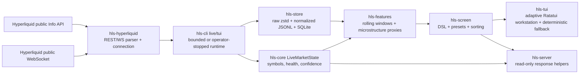
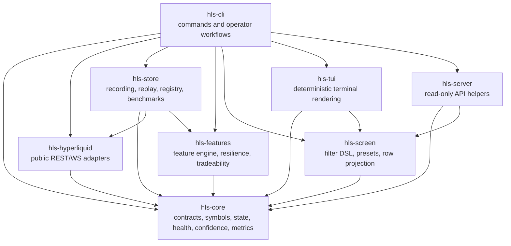
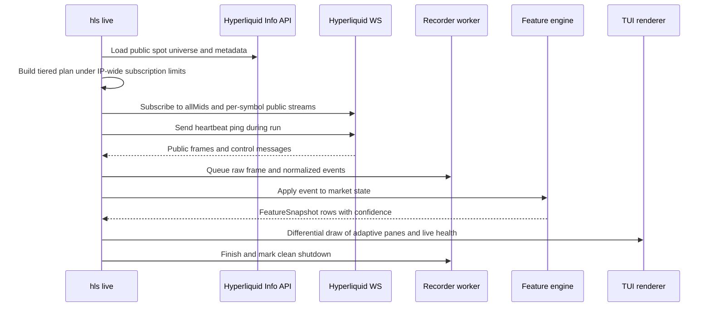
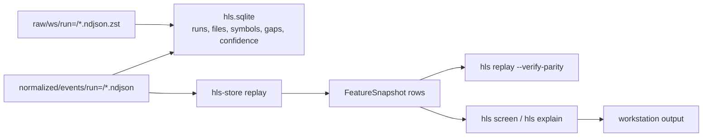

# Architecture

`hlscreen` is a read-only Hyperliquid spot market-data workstation. It ingests public market data, records local evidence, computes explainable screening features, renders a deterministic terminal UI, and exposes read-only health/API helpers.

It does not own private keys, wallet permissions, private user streams, order placement, leverage, liquidation, execution, or capital controls.

## System Boundary

## Crate Ownership

## Live Data Flow

Runtime rules:

- All-symbol mode budgets subscriptions before connecting. On 2026-07-10 the public spot universe had `309` symbols. One global `allMids` subscription plus per-symbol `trades`, `bbo`, and `activeAssetCtx` streams produce `928` subscriptions, below the configured `980` headroom and official `1,000` IP-wide limit. If that richer plan no longer fits, the runtime first falls back to global mids plus per-symbol contexts, then to the one global mids stream; reduced plans expose lower confidence rather than inventing unavailable data.
- Disk writes are off the WebSocket read loop through a bounded worker queue. Backpressure fails closed instead of silently dropping data.
- Reconnects resubscribe through a rolling 60-second outbound-message limiter and record explicit data gaps. Automatic REST backfill after reconnect is not implemented.
- An inbound inactivity watchdog reconnects a socket that remains open without delivering a market-data event for 60 seconds; acknowledgements and pong/control frames do not mask a stalled feed.
- Trade history is bounded to one hour and 100,000 events per symbol; quote/candle histories have smaller fixed caps. Out-of-order events are retained chronologically without regressing current displayed state.
- Ratatui uses one persistent terminal with differential draws and skip-on-missed-tick timers. Display payloads retain only the latest 64 candles/trades per symbol, independent of the larger analytical state. Display pause freezes rows, candles, and prints while ingestion, recording, health, and navigation continue.
- The TUI renders `p95 row age`, which is row freshness, not a compute-latency SLA.

## Replay And Screening Flow

Replay rules:

- Dirty or incomplete runs are rejected.
- Run IDs and registry paths are validated before file access; existing run IDs cannot replace prior evidence.
- `hls replay --verify-parity` writes a confidence baseline on first run and fails non-zero on later drift.
- Replay parity checks confidence/data-quality state, not profitability or strategy quality.

## Current Command Surfaces

- `hls init`: create local config/data directories.
- `hls doctor`: print read-only health and low-cardinality metrics.
- `hls symbols`: inspect public spot universe metadata.
- `hls live`: bounded public live screen/recording.
- `hls tui`: adaptive full-screen live workstation, unbounded until operator stop by default.
- `hls record`: deterministic fixture recording path.
- `hls replay`: replay normalized local captures and verify parity.
- `hls screen`: filter/sort feature snapshots with presets or custom DSL.
- `hls explain`: show why-ranked score components for one row.
- `hls bench`: run deterministic public fixture benchmark packs.
- `hls server --print-health`: print read-only API preview JSON.

## Production-Readiness Boundary

Production-ready today means:

- Run locally or in a supervised environment as a read-only public-data process.
- Capture raw and normalized public data for replay.
- Fail closed on writer backpressure, invalid configs, parser-private channels, invalid DSL, missing fixtures, unsupported Parquet output, and replay parity drift.
- Emit deterministic non-TTY output, a full adaptive Ratatui workstation, and low-cardinality health metrics.

Not production-ready today:

- Unbounded daemon/service mode.
- Hosted web API.
- Public release binaries from a proven `v*` tag.
- Public REST backfill after reconnect.
- True Parquet output.
- Extended all-symbol soak evidence after each material exchange-limit or runtime change.
- Any live trading, wallet, private stream, or order execution behavior.

See [production-readiness.md](production-readiness.md) for the current validation evidence and deployment checklist.
