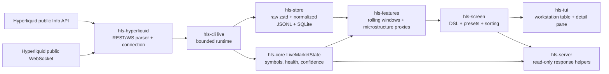
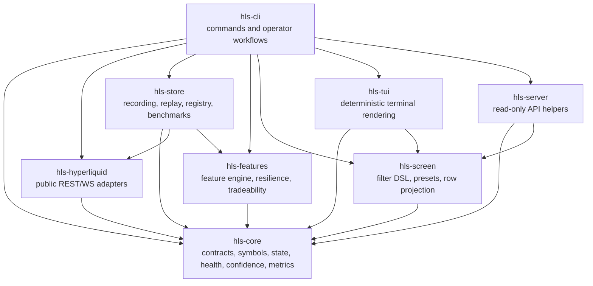
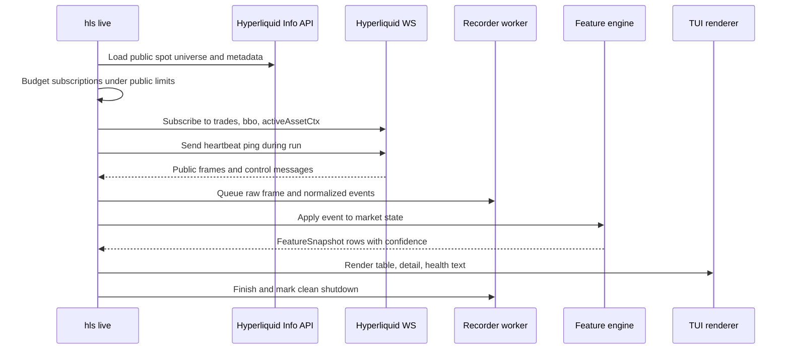
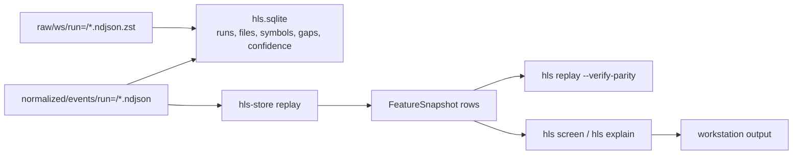

# Architecture

`hlscreen` is a read-only Hyperliquid spot market-data workstation. It ingests public market data, records local evidence, computes explainable screening features, renders a deterministic terminal UI, and exposes read-only health/API helpers.

It does not own private keys, wallet permissions, private user streams, order placement, leverage, liquidation, execution, or capital controls.

## System Boundary

## Crate Ownership

## Live Data Flow

Runtime rules:

- All-symbol mode budgets subscriptions before connecting. On 2026-07-08 the public spot universe had `308` symbols; `trades`, `bbo`, and `activeAssetCtx` produce `924` subscriptions, under the configured headroom and official public limit.
- Disk writes are off the WebSocket read loop through a bounded worker queue. Backpressure fails closed instead of silently dropping data.
- Reconnects resubscribe and record explicit data gaps. Automatic REST backfill after reconnect is not implemented.
- The TUI renders `p95 row age`, which is row freshness, not a compute-latency SLA.

## Replay And Screening Flow

Replay rules:

- Dirty or incomplete runs are rejected.
- `hls replay --verify-parity` writes a confidence baseline on first run and fails non-zero on later drift.
- Replay parity checks confidence/data-quality state, not profitability or strategy quality.

## Current Command Surfaces

- `hls init`: create local config/data directories.
- `hls doctor`: print read-only health and low-cardinality metrics.
- `hls symbols`: inspect public spot universe metadata.
- `hls live`: bounded public live screen/recording.
- `hls record`: deterministic fixture recording path.
- `hls replay`: replay normalized local captures and verify parity.
- `hls screen`: filter/sort feature snapshots with presets or custom DSL.
- `hls explain`: show why-ranked score components for one row.
- `hls bench`: run deterministic public fixture benchmark packs.
- `hls server --print-health`: print read-only API preview JSON.

## Production-Readiness Boundary

Production-ready today means:

- Run locally or in a supervised environment as a read-only public-data process.
- Capture raw and normalized public data for replay.
- Fail closed on writer backpressure, invalid configs, parser-private channels, invalid DSL, missing fixtures, unsupported Parquet output, and replay parity drift.
- Emit deterministic terminal output, keyboard-focused live TUI state, and low-cardinality health metrics.

Not production-ready today:

- Unbounded daemon/service mode.
- Hosted web API.
- Public release binaries from a proven `v*` tag.
- Public REST backfill after reconnect.
- True Parquet output.
- Full alternate-screen widget-grid or mouse-driven TUI. Current `hls live --tui` supports keyboard row focus, view cycling, density, help, pause state, and clean quit in real terminals.
- Any live trading, wallet, private stream, or order execution behavior.

See [production-readiness.md](production-readiness.md) for the current validation evidence and deployment checklist.
